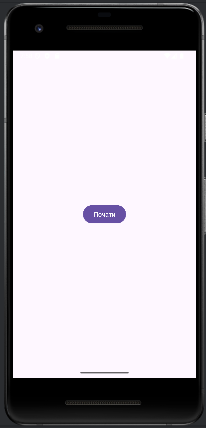
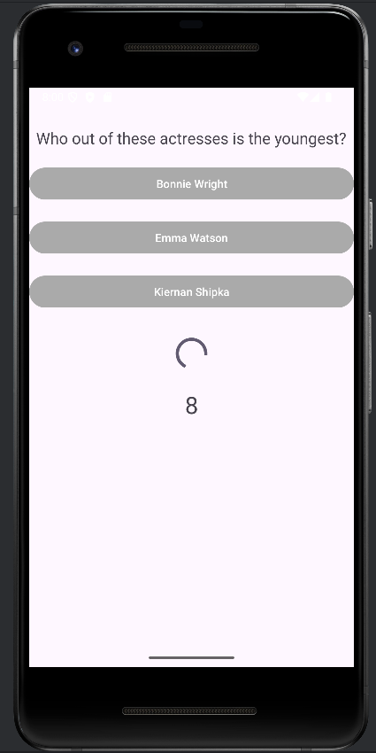
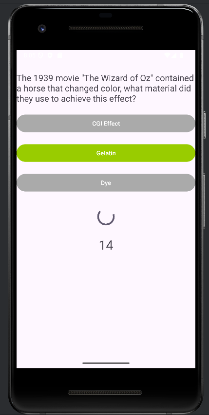
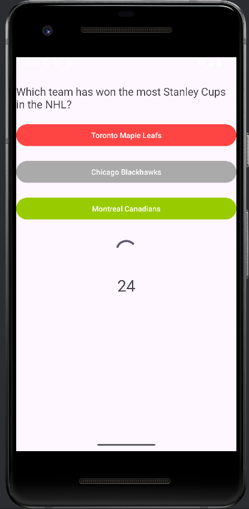
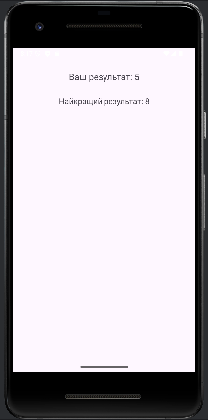

# Лабораторна робота №6

**Виконала студентка ІО-25, Борисенко Таміла**

## Опис реалізації

У рамках цієї лабораторної роботи був реалізований Android-додаток для вікторини, який взаємодіє з відкритим API для отримання запитань та варіантів відповідей.

### Основні функції:
- **Отримання даних з API**:
    - Використано бібліотеку Retrofit для виконання HTTP запитів до Open Trivia Database API.
    - Отримання запитань з варіантами відповідей.

- **Інтерфейс користувача**:
    - Відображення запитань та варіантів відповідей.
    - Використання Button для варіантів відповідей, TextView для відображення тексту запитання та результату.
    - Таймер на 30 секунд для кожного питання.

- **Логіка вікторини**:
    - Після завантаження питань з API, програма відображає кожне питання з перемішаними варіантами відповідей.
    - Користувач обирає відповідь, після чого програма переходить до наступного питання або завершується, якщо всі питання відповіли.
    - В кінці вікторини виводиться результат з підсумковим рахунком.

- **Обробка відповіді користувача**:
    - Перевірка вибору користувача на правильність.
    - Обчислення балів на основі правильних відповідей.

- **Таймер**:
    - На кожне питання виділяється 30 секунд для відповіді.
    - В кінці кожного питання відображається результат вибору.

### Опис класів:
1. **ApiClient.java**
    - Цей клас відповідає за налаштування клієнта для виконання HTTP запитів за допомогою бібліотеки Retrofit. Він ініціалізує об'єкт Retrofit і надає доступ до інтерфейсу TriviaApiService, який дозволяє взаємодіяти з Open Trivia Database API для отримання запитань.
    - Використовує базову URL-адресу API: https://opentdb.com/.
    - Включає метод getApiService(), який повертає об'єкт TriviaApiService для здійснення запитів.

2. **TriviaApiService.java**
    - Цей інтерфейс визначає HTTP запити до API для отримання вікторинних запитань. В даному випадку використовується метод для отримання питань за допомогою Retrofit.
    - Метод getQuestions(int amount, String type) визначає запит для отримання певної кількості питань із зазначеними параметрами.

3. **Question.java**
    - Цей клас представляє окреме питання вікторини. Він включає текст питання, правильну відповідь і список неправильних відповідей. Використовується для зберігання даних про кожне питання, що отримується з API.

4. **QuestionResponse.java**
    - Цей клас представляє відповідь від API, що містить код відповіді та список запитань вікторини. Використовується для отримання та обробки результатів API-запиту.
    - **Поля**:
        - response_code — код відповіді (використовується для перевірки статусу запиту).
        - results — список питань, які повертаються API.

5. **QuizActivity.java**
    - Ця активність реалізує логіку самої вікторини. Вона відповідає за завантаження запитань, відображення їх користувачеві, обробку вибору відповідей, запуск таймера та підсумовування балів.
    - Включає:
        - Завантаження питань з API при запуску.
        - Перемішування варіантів відповідей.
        - Перевірку вибору користувача на правильність.
        - Таймер для кожного питання.
        - Показ результату після завершення вікторини.

6. **ResultActivity.java**
    - Ця активність відповідає за відображення результатів гри. Вона показує поточний результат користувача та найкращий результат, збережений у SharedPreferences.
    - Якщо поточний результат кращий за збережений, оновлюється найкращий результат.

7. **StartActivity.java**
    - Ця активність відповідає за екран старту, на якому користувач може натискати кнопку "Почати" для переходу до вікторини.
    - Потім відбувається перехід до активності QuizActivity при натисканні кнопки "Почати".

### Скріншоти роботи програми:

1. Екран старту з кнопкою "Почати"

2. Екран з питанням та варіантами відповідей 

3. Екран при натисканні правильної відповіді

4. Екран при натисканні неправильної відповіді

5. Екран з результатами вікторини

## Висновок
У рамках роботи був успішно реалізований Android-додаток для проведення вікторини, що отримує питання з відкритого API, надає можливість вибору відповідей і підсумовує бали після завершення тесту.
